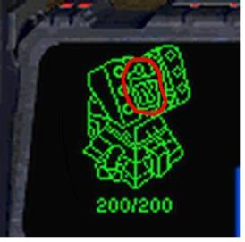

# [Algorithm/JS] 백준 1002번 터렛

[🔗 문제 바로가기](https://www.acmicpc.net/problem/1002)

## Question

조규현과 백승환은 터렛에 근무하는 직원이다. 하지만 워낙 존재감이 없어서 인구수는 차지하지 않는다. 다음은 조규현과 백승환의 사진이다.

이석원은 조규현과 백승환에게 상대편 마린(류재명)의 위치를 계산하라는 명령을 내렸다. 조규현과 백승환은 각각 자신의 터렛 위치에서 현재 적까지의 거리를 계산했다.

조규현의 좌표 (x1, y1)와 백승환의 좌표 (x2, y2)가 주어지고, 조규현이 계산한 류재명과의 거리 r1과 백승환이 계산한 류재명과의 거리 r2가 주어졌을 때, 류재명이 있을 수 있는 좌표의 수를 출력하는 프로그램을 작성하시오.

### Input

첫째 줄에 테스트 케이스의 개수 T가 주어진다. 각 테스트 케이스는 다음과 같이 이루어져 있다.

한 줄에 x1, y1, r1, x2, y2, r2가 주어진다. x1, y1, x2, y2는 -10,000보다 크거나 같고, 10,000보다 작거나 같은 정수이고, r1, r2는 10,000보다 작거나 같은 자연수이다.

### Output

각 테스트 케이스마다 류재명이 있을 수 있는 위치의 수를 출력한다. 만약 류재명이 있을 수 있는 위치의 개수가 무한대일 경우에는 -1을 출력한다.

### Input

```
3
0 0 13 40 0 37
0 0 3 0 7 4
1 1 1 1 1 5
```

### Output

```
2
1
0
```

## Solution

이 문제는 각 좌표(x1, y1), (x2, y2)가 원의 중심이고, 반지름이 r1, r2 일 때 두 원의 접점의 개수를 출력하는 문제다.

먼저 **두 원 중심의 거리**와 **두 반지름의 합**, **두 반지름의 차이**를 알아야한다.

1. dist = 두 원 중심의 거리
2. rsum = 두 반지름의 합
3. rsub = 두 반지름의 차

### 접점이 무한대일 경우

두 원의 접점이 무한대일 경우는 두 원이 완전히 겹쳐졌을 경우이다. 즉, 크기가 동일(rsub = 0)하고, 좌표가 같다(dist = 0).

> **dist === 0 || rsub === 0**

### 접점이 없을 경우

1. 두 원이 조금도 포함관계를 이루지 않을 경우 (dist > rsum)
2. 한 원 안에 다른 원이 접점없이 완전히 포함될 경우 (dist < rsub)

> **dist > rsum || dist < rsub**

### 접점이 하나일 경우

1. 한 원 안에 다른 원이 완전히 포함되어 접점이 하나일 경우 (dist = rsum)
2. 두 원이 포함관계를 이루지 않으나 하나의 접점이 있을 경우 (dist = rsub)

> **dist === rsum || dist === rsub**

### 접점이 두개일 경우

두 원 중심의 거리가 두 반지름 합보다 작고, 두 반지름 차이보다 클 경우

> **dist < rsum && dist > sub**

```js
const fs = require('fs');
const [count, ...input] = fs.readFileSync('../input.txt').toString().trim().split('\n');

input.map((t) => {
  const [x1, y1, r1, x2, y2, r2] = t.split(' ').map(Number);
  const dist = Math.sqrt(Math.pow(x1 - x2, 2) + Math.pow(y1 - y2, 2)); // 두 좌표의 거리
  const rsum = r1 + r2; // 두 원의 반지름 합
  const rsub = Math.abs(r1 - r2); // 두 반지름 차의 절댓값

  if ((dist === 0) & (rsub === 0)) return console.log(-1);
  if (dist > rsum || dist < rsub) return console.log(0);
  if (dist === rsum || dist === rsub) return console.log(1);
  console.log(2);
});
```

[풀이 참고](https://wookgu.tistory.com/18)
