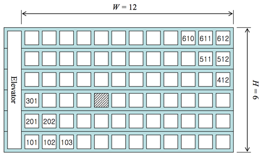

# [Algorithm/JS] 백준 10250번 ACM 호텔

[🔗 문제 바로가기](https://www.acmicpc.net/problem/10250)

## Question

ACM 호텔 매니저 지우는 손님이 도착하는 대로 빈 방을 배정하고 있다. 고객 설문조사에 따르면 손님들은 호텔 정문으로부터 걸어서 가장 짧은 거리에 있는 방을 선호한다고 한다. 여러분은 지우를 도와 줄 프로그램을 작성하고자 한다. 즉 설문조사 결과 대로 호텔 정문으로부터 걷는 거리가 가장 짧도록 방을 배정하는 프로그램을 작성하고자 한다.

문제를 단순화하기 위해서 호텔은 직사각형 모양이라고 가정하자. 각 층에 W 개의 방이 있는 H 층 건물이라고 가정하자 (1 ≤ H, W ≤ 99). 그리고 엘리베이터는 가장 왼쪽에 있다고 가정하자(그림 1 참고). 이런 형태의 호텔을 H × W 형태 호텔이라고 부른다. 호텔 정문은 일층 엘리베이터 바로 앞에 있는데, 정문에서 엘리베이터까지의 거리는 무시한다. 또 모든 인접한 두 방 사이의 거리는 같은 거리(거리 1)라고 가정하고 호텔의 정면 쪽에만 방이 있다고 가정한다.



방 번호는 YXX 나 YYXX 형태인데 여기서 Y 나 YY 는 층 수를 나타내고 XX 는 엘리베이터에서부터 세었을 때의 번호를 나타낸다. 즉, 그림 1 에서 빗금으로 표시한 방은 305 호가 된다.

손님은 엘리베이터를 타고 이동하는 거리는 신경 쓰지 않는다. 다만 걷는 거리가 같을 때에는 아래층의 방을 더 선호한다. 예를 들면 102 호 방보다는 301 호 방을 더 선호하는데, 102 호는 거리 2 만큼 걸어야 하지만 301 호는 거리 1 만큼만 걸으면 되기 때문이다. 같은 이유로 102 호보다 2101 호를 더 선호한다.

여러분이 작성할 프로그램은 초기에 모든 방이 비어있다고 가정하에 이 정책에 따라 N 번째로 도착한 손님에게 배정될 방 번호를 계산하는 프로그램이다. 첫 번째 손님은 101 호, 두 번째 손님은 201 호 등과 같이 배정한다. 그림 1 의 경우를 예로 들면, H = 6이므로 10 번째 손님은 402 호에 배정해야 한다.

### Input

프로그램은 표준 입력에서 입력 데이터를 받는다. 프로그램의 입력은 T 개의 테스트 데이터로 이루어져 있는데 T 는 입력의 맨 첫 줄에 주어진다. 각 테스트 데이터는 한 행으로서 H, W, N, 세 정수를 포함하고 있으며 각각 호텔의 층 수, 각 층의 방 수, 몇 번째 손님인지를 나타낸다(1 ≤ H, W ≤ 99, 1 ≤ N ≤ H × W).

### Output

프로그램은 표준 출력에 출력한다. 각 테스트 데이터마다 정확히 한 행을 출력하는데, 내용은 N 번째 손님에게 배정되어야 하는 방 번호를 출력한다.

## Example

### Input

```
2
6 12 10
30 50 72
```

### Output

```
402
1203
```

## Solution

### Solution 1 (실패)

```js
const [count, ...input] = require('fs')
  .readFileSync('dev/stdin')
  .toString()
  .trim()
  .split('\n');
input.map((a) => {
  const [H, W, N] = a.split(' ').map(Number);
  let yy = (N % H).toString(); // 층
  let xx = Math.ceil(N / H).toString(); // 호
  if (xx.length == 1) xx = `0${xx}`;
  console.log(yy + xx);
});
```

yy 는 층, xx 는 호를 나타낸다.

N 번째 방의 층(yy)을 구하려면 N 을 층수로 나눈 나머지를 구하면 된다.

> yy = N % H

방의 호수(xx)를 구하려면 N을 층 수만큼 나누면 된다. 호 수를 구할 때 주의할 점은 나눈 값이 나누어 떨어지지 않을 때를 대비하여 반올림을 해줘야한다. (`Math.ceil` 메소드)

> xx = Meth.ceil(N / H);

마지막으로 호수가 한 자리수라면 10의 자리를 0으로 지정해준다.

예제의 입력값으로 실행시켜보았을 때 문제의 출력값과 일치한다.

> 틀렸습니다.
> x

그러나 위 풀이는 실패한 풀이다.

[https://www.acmicpc.net/board/view/74683](https://www.acmicpc.net/board/view/74683)

이 문제에 대한 반례를 찾았다. 출력값이 상이한 입력값이 있어 확인해보니

층 수를 구할 때, 가장 마지막 층이 되면 yy 값이 0 이 되므로 가장 높은 층(H) 으로 대입해주어야 한다는 것을 알 수 있었다.

### Solution 2 (성공)

다시 시도한 풀이다.

```js
const [count, ...input] = require('fs')
  .readFileSync('../input.txt')
  .toString()
  .trim()
  .split('\n');
input.map((a) => {
  const [H, W, N] = a.split(' ').map(Number);
  let xx = Math.ceil(N / H); // 호
  let yy = N % H; // 층
  if (yy === 0) yy = H;
  if (xx / 10 < 1) xx = `0${xx}`;
  console.log(`${yy}${xx}`);
});
```

위에서 가독성이 좋지 않은 코드들도 함께 수정했다.

층 수가 한 자리 수임을 확인하는 코드를 문자열의 length 가 아닌 연산으로 찾아냈다.

10으로 나눈 값이 1보다 작다면 한 자리 수라는 의미이므로 한자리 수라면 백틱을 사용해 숫자 앞에 0을 붙여줬다. 출력값 역시 백틱을 통해 문자열로 합쳤다

> 정답
