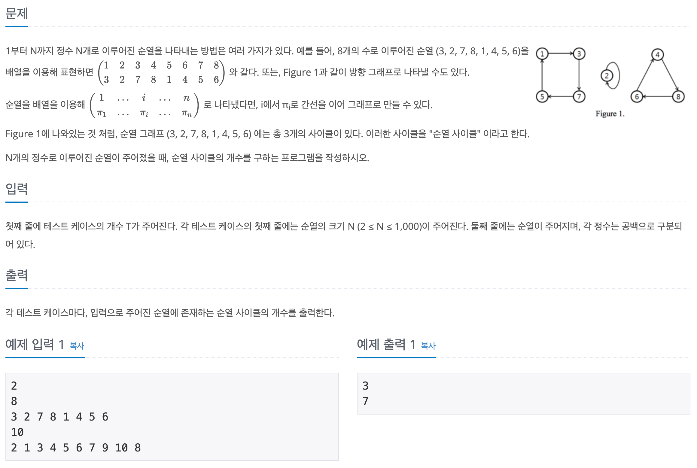

# [Algorithm/JS] 백준 10451번 순열 사이클

[🔗 문제 바로가기](https://www.acmicpc.net/problem/10451)

## Question



## Solution

알고리즘: DFS (깊이 우선 탐색)

### 전체코드

```js
const fs = require('fs');
const filePath = process.platform === 'linux' ? 'dev/stdin' : '../input.txt';
const input = fs.readFileSync(filePath).toString().trim().split('\n');

const n = +input.shift();
const tc = []; // test case
for (let i = 0; i < input.length; i += 2) {
  let c = input.slice(i, i + 2);
  tc.push(c);
}

tc.map((t) => {
  let answer = 0;
  let size = +t[0];
  let perm = t[1].split(' ').map(Number);
  perm.unshift(0);

  const visited = new Array(size + 1).fill(0);
  for (let i = 1; i <= size; i++) {
    if (visited[i] === 0) {
      dfs(i);
      answer++;
    }
  }

  /* DFS */
  function dfs(v) {
    visited[v] = 1;
    if (visited[perm[v]] === 0) {
      dfs(perm[v]);
    }
  }
  console.log(answer);
});
```

하나의 사이클만 살펴보자면 첫번째 인덱스부터 시작하여 1 → 3 → 7 → 5 → 1 순서로 순회한다.

즉, 순열 그래프에서 간선으로 이어진 정점들 중 이미 방문하여 더이상 방문할 수 있는 경로가 없다면 하나의 사이클이 완료 된 것이다. 이를 코드로 나타내면 아래와 같이 나타낼 수 있다.

### DFS 부분 코드

```js
function dfs(v) {
  visited[v] = 1;
  if (visited[perm[v]] === 0) {
    dfs(perm[v]);
  }
}
```

dfs 함수가 실행되면 파라미터로 입력받은 정점(v) 을 방문한 것으로 처리한다.
perm 은 순열 배열이다. perm[v] 로 순열 값을 받아오며 그대로 visited 의 인덱스로 가져가 방문된 적이 없다면 재귀함수 실행한다. 그러면 또 인자로 전달된 정점은 방문처리가 되며 이 작업을 반복한다. 단, 다음 경로가 방문상태가 아니라면 그대로 종료된다.

### DFS 실행 코드

순열 배열의 크기만큼 반복문을 실행해 visited[i]에 방문되지 않은 상태라면 dfs 함수를 실행하고 순열 사이클 횟수를 카운트한다.

```js
for (let i = 1; i <= size; i++) {
  if (visited[i] === 0) {
    dfs(i);
    answer++;
  }
}
```
