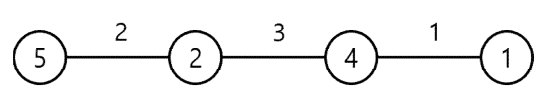

# [Algorithm/JS] 백준 13305번 전자레인지

[🔗 문제 바로가기](https://www.acmicpc.net/problem/13305)

## Question

서로 다른 N개의 자연수의 합이 S라고 한다. S를 알 때, 자연수 N의 최댓값은 얼마일까?

어떤 나라에 N개의 도시가 있다. 이 도시들은 일직선 도로 위에 있다. 편의상 일직선을 수평 방향으로 두자. 제일 왼쪽의 도시에서 제일 오른쪽의 도시로 자동차를 이용하여 이동하려고 한다. 인접한 두 도시 사이의 도로들은 서로 길이가 다를 수 있다. 도로 길이의 단위는 km를 사용한다.

처음 출발할 때 자동차에는 기름이 없어서 주유소에서 기름을 넣고 출발하여야 한다. 기름통의 크기는 무제한이어서 얼마든지 많은 기름을 넣을 수 있다. 도로를 이용하여 이동할 때 1km마다 1리터의 기름을 사용한다. 각 도시에는 단 하나의 주유소가 있으며, 도시 마다 주유소의 리터당 가격은 다를 수 있다. 가격의 단위는 원을 사용한다.

예를 들어, 이 나라에 다음 그림처럼 4개의 도시가 있다고 하자. 원 안에 있는 숫자는 그 도시에 있는 주유소의 리터당 가격이다. 도로 위에 있는 숫자는 도로의 길이를 표시한 것이다.



제일 왼쪽 도시에서 6리터의 기름을 넣고, 더 이상의 주유 없이 제일 오른쪽 도시까지 이동하면 총 비용은 30원이다. 만약 제일 왼쪽 도시에서 2리터의 기름을 넣고(2×5 = 10원) 다음 번 도시까지 이동한 후 3리터의 기름을 넣고(3×2 = 6원) 다음 도시에서 1리터의 기름을 넣어(1×4 = 4원) 제일 오른쪽 도시로 이동하면, 총 비용은 20원이다. 또 다른 방법으로 제일 왼쪽 도시에서 2리터의 기름을 넣고(2×5 = 10원) 다음 번 도시까지 이동한 후 4리터의 기름을 넣고(4×2 = 8원) 제일 오른쪽 도시까지 이동하면, 총 비용은 18원이다.

각 도시에 있는 주유소의 기름 가격과, 각 도시를 연결하는 도로의 길이를 입력으로 받아 제일 왼쪽 도시에서 제일 오른쪽 도시로 이동하는 최소의 비용을 계산하는 프로그램을 작성하시오.

### Input

표준 입력으로 다음 정보가 주어진다. 첫 번째 줄에는 도시의 개수를 나타내는 정수 N(2 ≤ N ≤ 100,000)이 주어진다. 다음 줄에는 인접한 두 도시를 연결하는 도로의 길이가 제일 왼쪽 도로부터 N-1개의 자연수로 주어진다. 다음 줄에는 주유소의 리터당 가격이 제일 왼쪽 도시부터 순서대로 N개의 자연수로 주어진다. 제일 왼쪽 도시부터 제일 오른쪽 도시까지의 거리는 1이상 1,000,000,000 이하의 자연수이다. 리터당 가격은 1 이상 1,000,000,000 이하의 자연수이다.

### Output

표준 출력으로 제일 왼쪽 도시에서 제일 오른쪽 도시로 가는 최소 비용을 출력한다.

### Sub task

| 번호 | 배점 | 제한                                                                                                         |
| ---- | ---- | ------------------------------------------------------------------------------------------------------------ |
| 1    | 17   | 모든 주유소의 리터당 가격은 1원이다.                                                                         |
| 2    | 41   | 2 ≤ N ≤ 1,000, 제일 왼쪽 도시부터 제일 오른쪽 도시까지의 거리는 최대 10,000, 리터 당 가격은 최대 10,000이다. |
| 3    | 42   | 원래의 제약조건 이외에 아무 제약조건이 없다.                                                                 |

## Example

### Input 1

```
4
2 3 1
5 2 4 1
```

### Output 1

```
18
```

### Input 2

```
4
3 3 4
1 1 1 1
```

### Output 2

```
10
```

## Solution

알고리즘: 그리디

이 문제는 다음 도시에서의 주유 가격이 현재 도시의 가격보다 저렴한지 비싼지 비교하여, 현재 도시의 주유 가격이 더 싸다면 현재 주유소에서 오른쪽에 있는 도시들의 거리까지 갈 수 있도록 주유를 해야한다. 단 오른쪽에 있는 도시들 중 현 주유소보다 더 싼 곳이 있다면 그 지점부터는 더 싼 가격으로 주유를 해야한다.

### 부분 성공(58점)

```js
const fs = require('fs');
const filePath = process.platform === 'linux' ? '/dev/stdin' : '../input.txt';
const [n, d, p] = fs.readFileSync(filePath).toString().trim().split('\n');

let dis = d.split(' ').map(Number); // 1
let cost = p.split(' ').map(Number); // 1

let curr = cost[0]; // 2
let sum = 0; // 3
for (let i = 0; i < n - 1; i++) {
  sum += curr * dis[i]; // 4
  if (curr > cost[i + 1]) curr = cost[i + 1]; // 5
}
console.log(sum);
```

알고리즘: 그리디

1. 도시 간의 거리를 dis 변수에 Number 타입 배열로, 주유소의 리터당 가격을 cost 배열에 Number 타입 배열로 할당했다.
2. curr 은 지나온 마을들 중 가장 싼 주유값을 담을 것이다. 초깃값으로 가장 앞 도시를 할당한다.
3. 가장 마지막 마을은 주유가 필요 없기 때문에 n - 1 까지 반복한다.
4. 지나온 거리까지 주유한 가격이다. (가격 x 거리)
5. 다음 도시의 주유 가격이 더 싸다면 `curr` 변수에 다음 주유 가격을 저장한다.

위 과정을 반복하면 최종적으로 최소의 비용을 계산할 수 있다.

> **58점 으로 부분 성공했다. 서브 태스크의 2번까지 수행한 것이다.**

3번 태스크의 ‘**원래의 제약조건 이외에 아무 제약조건이 없다.’** 가 무슨 의미인지 한참 고민했다.

다른 사람들의 코드를 보니 Number 타입이 아닌 BigInt 타입을 사용했다.

BigInt 는 길이의 ‘제약 없이’ 정수를 다룰 수 있게 해주는 숫자형이다.

### 성공 (100점)

코드를 모두 `Number` 타입이 아닌 `BigInt` 타입으로 변경하여 재 제출했다.

```js
const fs = require('fs');
const filePath = process.platform === 'linux' ? '/dev/stdin' : '../input.txt';
const [n, d, p] = fs.readFileSync(filePath).toString().trim().split('\n');

let dis = d.split(' ').map(BigInt);
let cost = p.split(' ').map(BigInt);

let curr = cost[0];
let sum = 0n;
for (let i = 0; i < n - 1; i++) {
  sum += curr * dis[i];
  if (curr > cost[i + 1]) curr = cost[i + 1];
}
console.log(String(sum));
```

> 성공!
