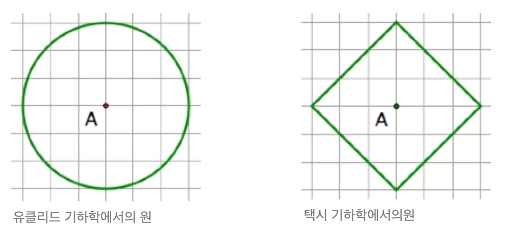

# [Algorithm/JS] 백준 3053번 택시 기하학

[🔗 문제 바로가기](https://www.acmicpc.net/problem/3053)

## Question

19세기 독일 수학자 헤르만 민코프스키는 비유클리드 기하학 중 택시 기하학을 고안했다.

택시 기하학에서 두 점 T1(x1,y1), T2(x2,y2) 사이의 거리는 다음과 같이 구할 수 있다.

D(T1,T2) = |x1-x2| + |y1-y2|

두 점 사이의 거리를 제외한 나머지 정의는 유클리드 기하학에서의 정의와 같다.

따라서 택시 기하학에서 원의 정의는 유클리드 기하학에서 원의 정의와 같다.

원: 평면 상의 어떤 점에서 거리가 일정한 점들의 집합

반지름 R이 주어졌을 때, 유클리드 기하학에서 원의 넓이와, 택시 기하학에서 원의 넓이를 구하는 프로그램을 작성하시오.

### Input

첫째 줄에 반지름 R이 주어진다. R은 10,000보다 작거나 같은 자연수이다.

### Output

첫째 줄에는 유클리드 기하학에서 반지름이 R인 원의 넓이를, 둘째 줄에는 택시 기하학에서 반지름이 R인 원의 넓이를 출력한다. 정답과의 오차는 0.0001까지 허용한다.

### Input 1

```
1
```

### Output 1

```
3.141593
2.000000
```
---
### Input 2

```
3.141593
2.000000
```

### Output 2

```
21
```

---

### Input 3

```
1385.442360
882.000000
```

### Input 2

```
42
```

### Output 3

```
5541.769441
3528.000000
```

## Solution

```js
const input = require('fs').readFileSync('dev/stdin').toString().trim();
const R = Number(input);
console.log((Math.pow(R, 2) * Math.PI).toFixed(6));
console.log((Math.pow(R, 2) * 2).toFixed(6));
```

유클리드 기하학과 택시 기하학은 난생 처음 들어보는 기법이었다.

문제만 봐서는 무슨 말인지 알 수 없어서 먼저 유클리드와 택시 기하학에 대해서 알아보았다.



위 이미지와 유클리드와 택시 기하학에 대한 내용은 [이 글](https://m.blog.naver.com/alwaysneoi/100172516753)을 참고했고,

위 이미지에서 힌트를 얻었다. 유클리드 기하학과 의 지름과 택시 기하학의 대각선 길이는 같다는 것을 알 수 있다.

때문에 유클리드 기하학 을 통한 원의 넓이는 원주율을 공식으로 구할 수 있었고,

택시 기하학 원은 마름모 넓이 공식을 통해 구할 수 있었다.

> 유클리드 가하학 원의 넓이 = 반지름^2 * 원주율  
> 택시 기하학 원의 넓이 = 반지름^2 * 2

따라서 제곱 연산을 하는 메소드 `Math.pow` 와 원주율 `Math.PI` 를 활용할 수 있으며

여섯번째 소수점까지 구하기 위해 `toFixed(6)` 메소드를 사용했다.

```js
유클리드 기하학에서 원의 넓이 = (Math.pow(R, 2) * Math.PI).toFixed(6)
택시 기하학에서 원의 넓이 = ((Math.pow(R, 2) * 2).toFixed(6)
```
