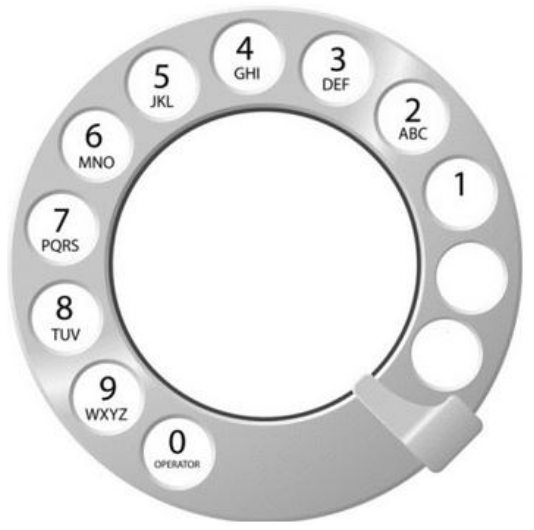

# [Algorithm/JS] 백준 5622번 다이얼

[🔗 문제 바로가기](https://www.acmicpc.net/problem/5622)

## Question

상근이의 할머니는 아래 그림과 같이 오래된 다이얼 전화기를 사용한다.



전화를 걸고 싶은 번호가 있다면, 숫자를 하나를 누른 다음에 금속 핀이 있는 곳 까지 시계방향으로 돌려야 한다. 숫자를 하나 누르면 다이얼이 처음 위치로 돌아가고, 다음 숫자를 누르려면 다이얼을 처음 위치에서 다시 돌려야 한다.

숫자 1을 걸려면 총 2초가 필요하다. 1보다 큰 수를 거는데 걸리는 시간은 이보다 더 걸리며, 한 칸 옆에 있는 숫자를 걸기 위해선 1초씩 더 걸린다.

상근이의 할머니는 전화 번호를 각 숫자에 해당하는 문자로 외운다. 즉, 어떤 단어를 걸 때, 각 알파벳에 해당하는 숫자를 걸면 된다. 예를 들어, UNUCIC는 868242와 같다.

할머니가 외운 단어가 주어졌을 때, 이 전화를 걸기 위해서 필요한 최소 시간을 구하는 프로그램을 작성하시오.

### Input

첫째 줄에 알파벳 대문자로 이루어진 단어가 주어진다. 단어의 길이는 2보다 크거나 같고, 15보다 작거나 같다.

### Output

첫째 줄에 다이얼을 걸기 위해서 필요한 최소 시간을 출력한다.

## Example

### Input 1

```
WA
```

### Output 1

```
13
```

### Input 2

```
UNUCIC
```

### Output 2

```
36
```

## Solution

```js
const input = require('fs').readFileSync('../input.txt').toString().trim().split('');
const dials = ['ABC', 'DEF', 'GHI', 'JKL', 'MNO', 'PQRS', 'TUV', 'WXYZ'];

let result = 0;
input.map((a) => {
  dials.map((dial, i) => {
    if (dial.includes(a)) result += 3 + i;
  });
});
console.log(result);
```
